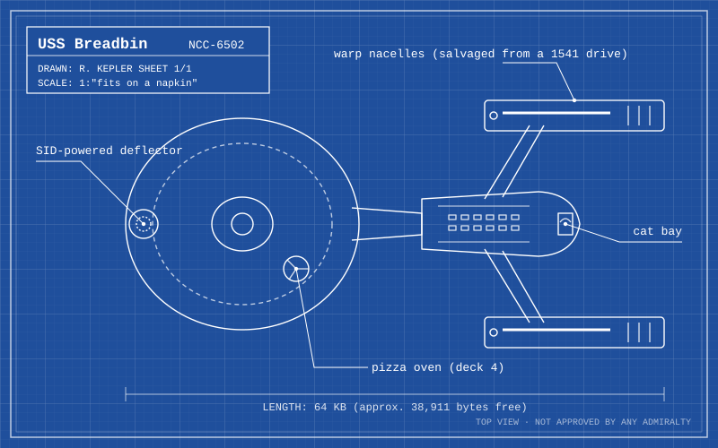

- The one true franchise. (Fight me in the comments of this outline.) #trek
- My starship design, drawn on graph paper at age 12 and digitized at 35:
- 
- Captains, ranked (final, non-negotiable, changes weekly) [↳](<Captains, ranked (final, non-negotiable, changes weekly)/_node.md>)
- Rewatch plan: *Deep Space Nine*, from the start [↳](<Rewatch plan%253A Deep Space Nine, from the start/_node.md>)
- My Rules of Engineering (with apologies to the Ferengi) [↳](<My Rules of Engineering (with apologies to the Ferengi)/_node.md>)
- Replicator recipes [↳](<Replicator recipes/_node.md>)
- Essays I wrote when I should have been sleeping [↳](<Essays I wrote when I should have been sleeping/_node.md>)
