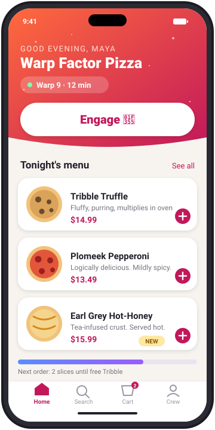

- Our pizza app for **Android and iOS**, built from one **Kotlin Multiplatform** codebase. Codename *Slice*. 
- Open bugs, live: {{search: #bug -#done}}
- Architecture [↳](<Architecture/_node.md>)
- Sprint 42 [↳](<Sprint 42/_node.md>)
- Bugs and oddities [↳](<Bugs and oddities/_node.md>)
- Code snippets I keep looking up [↳](<Code snippets I keep looking up/_node.md>)
