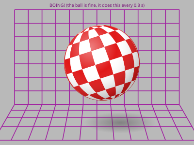

- Amiga 500, rev 6A board, Kickstart 1.3, 512K + 512K trapdoor expansion. Named after the video chip, and because she has opinions. #amiga
- 
- How she works inside — a drawing I made while waiting for a disk to load:
- 
- Guru Meditation log [↳](<Guru Meditation log/_node.md>)
- To do [↳](<To do/_node.md>)
- Games and demos, ranked [↳](<Games and demos, ranked/_node.md>)
