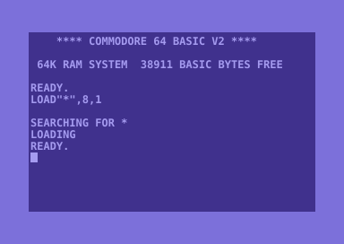
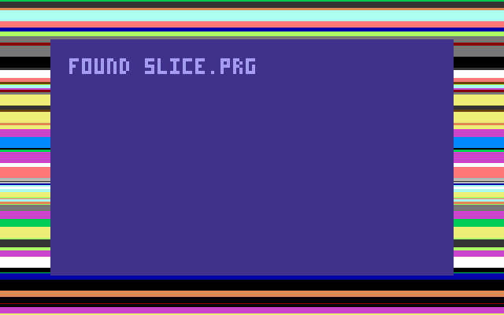

- C64 (1982, breadbin case, rev. B board), 1541 floppy drive, 1530 datasette. Bought for 40 € and a pizza. #c64
- 
- Try the [C64 simulator](C64%20simulator.html) in the files below: click it, type `RUN`, and witness the famous maze.
- Repair log [↳](<Repair log/_node.md>)
- Programs I keep typing in [↳](<Programs I keep typing in/_node.md>)
- POKE cheat sheet [↳](<POKE cheat sheet/_node.md>)
- SID music I listen to while coding [↳](<SID music I listen to while coding/_node.md>)
- Tape loading, the way it was meant to be suffered: 
