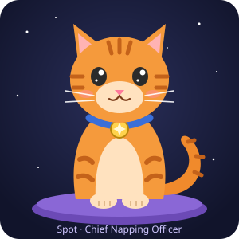

- The secret: every one of these levels is a real folder on disk, each with its own `_node.md` file. Your notes are just files, all the way down. 🎉
- Reward: Spot has approved your security clearance. 
- Now go back up and try `⌘F` with `#todo` — I have *a lot* of unfinished business.
